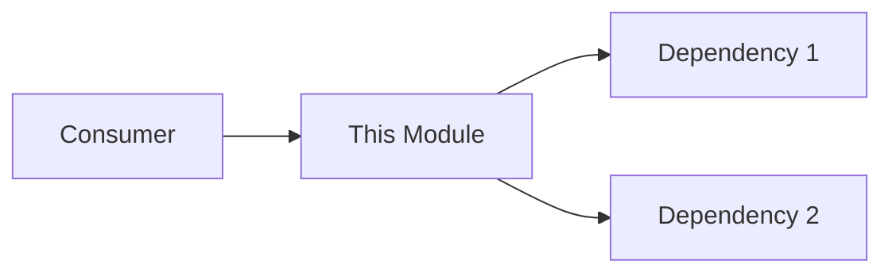

# xdoc - Comprehensive Documentation Generator & Updater

## Purpose
Generate exhaustive design documentation per module and update existing documentation based on code refactoring, renames, and structural changes. Creates and maintains documentation in the `claudify/{module}/` structure.

## Process

### 1. Module Discovery & Documentation Structure
**First, discover all code modules and create documentation structure:**
- Scan project for all code directories (excluding tests, docs, claudify)
- Create `claudify/{module}/` folder for each discovered module if it doesn't exist
- Check each module folder for existing `.md` files to update
- Generate module-specific documentation based on that module's code

**Documentation structure per module:**
```
claudify/
├── auth/                      # Module folder
│   ├── README.md             # Module overview & architecture
│   ├── prd-*.md              # Existing PRDs (preserve)
│   ├── features-*.md         # Existing features (update)
│   ├── tasks-*.md            # Existing tasks (update)
│   └── API.md                # API reference (generate/update)
├── payments/
│   ├── README.md             # Module documentation
│   ├── prd-checkout.md       # Existing PRD
│   └── ...
└── core/
    └── README.md              # Core module docs
```

### 2. Documentation Update Strategy
**For each module folder in claudify:**
1. **Preserve user content**: Keep PRDs, features, task descriptions
2. **Update technical references**: Fix function names, paths, signatures
3. **Generate missing docs**: Create README if doesn't exist
4. **Sync with code**: Update examples to match current implementation
5. **Fix broken links**: Update cross-references between documents

### 3. Per-Module Analysis
**For each code module, analyze:**
- All source files in that module directory
- Module's public API and exports
- Internal functions and classes
- Dependencies on other modules
- Test files for usage examples
- Module-specific patterns and conventions

### 4. Module Documentation Template
```markdown
# Module: [module_name]

## 📋 Overview
Brief description of what this module provides

## 🏗️ Architecture
How this module is structured internally

### Key Components
- **Component A**: Description (`path/to/file.py:123`)
- **Component B**: Description (`path/to/file.py:456`)

### Dependencies
- Uses: [other_module] for [purpose]
- Required by: [dependent_module]

## 🔌 Public API

### Functions
| Function | Description | Parameters | Returns | File |
|----------|-------------|------------|---------|------|
| func() | What it does | param: type | type | file.py:12 |

### Classes
| Class | Description | Key Methods | File |
|-------|-------------|------------|------|
| MyClass | Purpose | method1(), method2() | file.py:45 |

## 💡 Usage Examples

### Basic Usage
```python
# Example from tests or actual usage
from module import function
result = function(data)
```

### Advanced Patterns
```python
# Complex usage scenario
```

## 🔄 Module Interactions


## 📝 Recent Changes
- Updated function names from refactoring
- Fixed broken imports in examples
- Added new API endpoints

## ⚠️ Known Issues
- Any deprecations or pending changes

## 🧪 Testing
```bash
# How to test this module
pytest tests/test_module.py
```
```

### 5. Update Detection & Fixing
**Automatically detect and fix in existing docs:**
- Renamed functions/classes/modules → Update all references
- Moved files or reorganized directories → Fix import paths
- Changed API signatures → Update parameter lists
- Deleted code still referenced → Add deprecation notice
- Outdated import statements → Update to current structure
- Broken internal links → Fix cross-references
- Stale configuration examples → Update with current config

### 6. Generation Process
```bash
1. User: /xdoc
2. AI: Discovers all code modules in project
3. AI: Creates claudify/{module}/ folders as needed
4. AI: For each module:
   - Scans existing .md files in claudify/{module}/
   - Updates outdated references
   - Analyzes module's code
   - Generates/updates README.md
   - Creates/updates API.md if module has public API
5. AI: "Documentation complete:
   - Created docs for 3 new modules
   - Updated 5 existing module docs
   - Fixed 12 broken references
   - Generated API docs for 4 modules"
```

### 7. Module-Specific Considerations
**Tailor documentation to module type:**
- **API modules**: Focus on endpoints, request/response formats
- **Core modules**: Emphasize architecture and design patterns
- **Utility modules**: Provide extensive usage examples
- **Service modules**: Document configuration and integration
- **UI modules**: Include component examples and props

### 8. Cross-Module Documentation
**Create a project overview:**
- Generate `claudify/README.md` with all modules
- Show module dependency graph
- List all available modules with brief descriptions
- Provide navigation links to each module's docs

## Key Principles
- **Module-focused**: Each module gets its own documentation
- **Context-aware**: Documentation based on module's actual code
- **Preserve intent**: Keep user-written PRDs and specs intact
- **Auto-organize**: Create folder structure automatically
- **Update smartly**: Fix technical details, preserve descriptions
- **Comprehensive**: Cover all significant code per module

## Standards References
- Python Standards: `_shared/python-standards.md`
- Testing Patterns: `_shared/testing-standards.md`
- File Formats: `_shared/file-formats.md`

## Example Module Discovery
```
Project structure:
├── auth/           → Creates claudify/auth/
├── payments/       → Creates claudify/payments/
├── core/          → Creates claudify/core/
├── utils/         → Creates claudify/utils/
├── api/           → Creates claudify/api/
└── tests/         → Skipped (test directory)
```

## Special Features
- **Auto-create module folders** in claudify/
- **Module-specific docs** based on that module's code
- **Preserve VIBE workflow** files (PRDs, specs, tasks)
- **Smart updates** that don't overwrite user content
- **Cross-reference fixing** across all documents
- **API extraction** from module exports
- **Test-based examples** from module's test files
- **Dependency mapping** between modules

## Output Files Per Module
For each discovered module, create/update:
- `claudify/{module}/README.md` - Module overview
- `claudify/{module}/API.md` - Public API reference (if applicable)
- Update existing `prd-*.md`, `features-*.md`, `tasks-*.md` files
- `claudify/README.md` - Project-wide overview

## Module Detection Rules
**Include as modules:**
- Top-level directories with Python/JS/TS files
- Directories with `__init__.py` or `index.js/ts`
- Subdirectories representing logical modules

**Exclude from modules:**
- `tests/`, `test/`, `__tests__/`
- `docs/`, `documentation/`
- `claudify/` itself
- `.git/`, `node_modules/`, `__pycache__/`
- `build/`, `dist/`, `coverage/`
- Configuration directories (`.vscode/`, `.github/`)