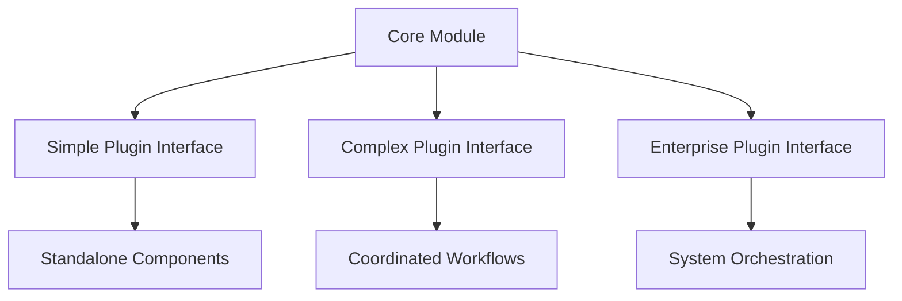
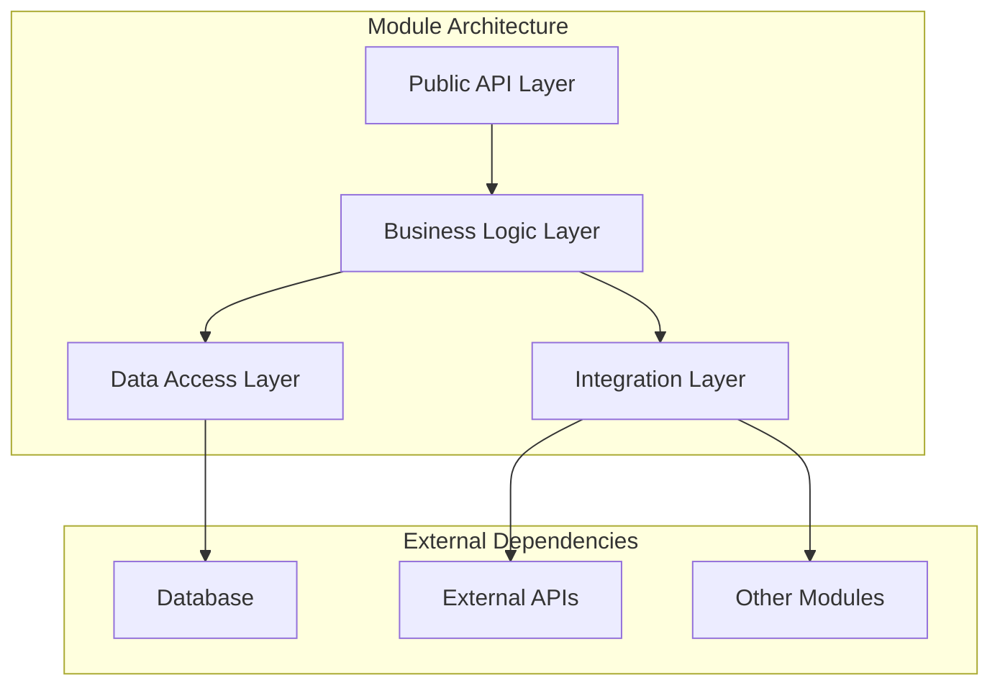
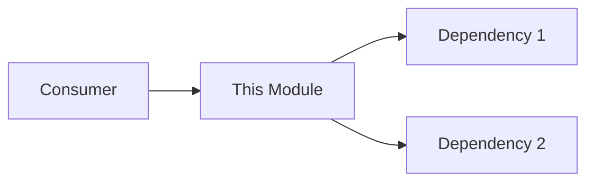

# xdoc - Comprehensive Documentation Generator & Updater

## Purpose
Generate exhaustive design documentation per module and update existing documentation based on code refactoring, renames, and structural changes. Creates and maintains documentation in the `{module}/docs/` structure.

## Process

### 1. Project Context Analysis & Module Discovery
**First, analyze project-level context before module assessment:**
- **Read project documentation**: Analyze root `README.md`, architecture docs, design documents
- **Understand project purpose**: Extract business goals, target users, success metrics
- **Map project architecture**: Identify intended system design, integration patterns
- **Review project constraints**: Technical stack, performance requirements, scalability needs
- **Scan project for modules**: Discover all code directories (excluding tests, global docs)
- **Create documentation structure**: Establish `{module}/docs/` folders as needed
- **Inventory existing docs**: Check each module folder for existing `.md` files to update

**Documentation structure per module:**
```
project/
├── README.md                  # Project root documentation
├── auth/                      # Module folder
│   ├── docs/                  # Module documentation
│   │   ├── README.md         # Module overview & architecture
│   │   ├── prd-*.md          # Existing PRDs (preserve)
│   │   ├── feat-*.md         # Existing features (update)
│   │   ├── tasks-*.md        # Existing tasks (update)
│   │   └── API.md            # API reference (generate/update)
│   └── [module code files]
├── payments/
│   ├── docs/
│   │   ├── README.md         # Module documentation
│   │   ├── prd-checkout.md   # Existing PRD
│   │   └── ...
│   └── [module code files]
└── core/
    ├── docs/
    │   └── README.md          # Core module docs
    └── [module code files]
```

### 2. Documentation Update Strategy
**For each module folder with docs/ subfolder:**
1. **Refresh VIBE workflow documents**: Update PRDs, features, and tasks
   - **PRD refresh**: Update technical details while preserving requirements
   - **Feature refresh**: Sync feature status, dependencies, and implementation notes
   - **Task refresh**: Mark completed tasks, update progress, fix broken references
2. **Update technical references**: Fix function names, paths, signatures in all docs
3. **Generate missing docs**: Create README if doesn't exist
4. **Sync with code**: Update examples to match current implementation
5. **Fix broken links**: Update cross-references between documents

### 3. Context-Aware Module Analysis
**For each code module, analyze within project context:**
- **Project alignment**: How module serves overall project goals
- **Architectural fit**: Whether module follows intended project architecture
- **Integration coherence**: How module integrates with project's intended design
- **Source code analysis**: All files, APIs, functions, and classes in module
- **Dependencies assessment**: Module dependencies against project architecture
- **Usage patterns**: Test files and actual usage within project context
- **Conventions adherence**: Whether module follows project-wide patterns

### 4. Module Documentation Template
```markdown
# Module: [module_name]

## 📋 Overview
Brief description of what this module provides

## 🏢 Business Architecture

### Business Context
- **Domain**: What business domain this module serves
- **Value Proposition**: Key business value delivered
- **Stakeholders**: Primary users and beneficiaries

### Use Cases

#### Simple Use Cases (Complexity: S)
- **UC-001**: Basic [operation] workflow
  - **Integration**: Direct API calls, minimal dependencies
  - **Plugin Potential**: Standalone component, easy integration
  - **Example**: Simple CRUD operations, basic data validation

#### Complex Use Cases (Complexity: M)
- **UC-002**: Multi-step [process] with dependencies
  - **Integration**: Requires coordination with 2-3 other modules
  - **Plugin Potential**: Configurable behavior, event-driven
  - **Example**: User authentication with role-based permissions

#### Very Complex Use Cases (Complexity: C)
- **UC-003**: Enterprise-level [workflow] integration
  - **Integration**: Orchestrates multiple modules, external systems
  - **Plugin Potential**: Highly configurable, extensible architecture
  - **Example**: Full e-commerce checkout with payment, inventory, shipping

### Plugin Integration Strategy


## 🏗️ Technical Architecture

### System Structure


### Key Components
- **Component A**: Description (`path/to/file.py:123`)
- **Component B**: Description (`path/to/file.py:456`)

### Dependencies
- Uses: [other_module] for [purpose]
- Required by: [dependent_module]

## 📊 Architecture Analysis

### Project Context Alignment
- 🎯 **Goal Alignment**: How well module serves overall project objectives
- 🏗️ **Architecture Fit**: Adherence to project's intended architectural patterns
- 🔗 **Integration Coherence**: Consistency with project-wide integration philosophy
- 📊 **Resource Proportionality**: Whether module complexity matches its project importance

### Strengths
- ✅ **Project Contribution**: Effectively serves intended role in overall system
- ✅ **Modularity**: Well-separated concerns align with project's maintainability goals
- ✅ **Scalability**: Handles increased load matching project's growth requirements
- ✅ **Extensibility**: Plugin architecture supports project's ecosystem vision
- ✅ **Testability**: Clear interfaces enable project-wide testing strategy

### Limitations
- ⚠️ **Over-Engineering**: May exceed what project actually needs for its use cases
- ⚠️ **Architecture Drift**: Some patterns don't align with project's overall design
- ⚠️ **Performance**: O(n²) complexity may not meet project's performance requirements
- ⚠️ **Integration Complexity**: Plugin interface may be too complex for project's actual needs
- ⚠️ **Resource Mismatch**: Development effort may not match module's importance to project success

### Critical Review

#### Project Context Assessment
- **Project Goal Alignment**: How well does this module serve the overall project vision?
- **Architecture Coherence**: Does this module follow the intended project architecture?
- **Integration Philosophy**: Is the module's design consistent with project-wide integration patterns?
- **Resource Utilization**: Does the module's complexity match its importance to project success?

#### What We Got Right
- **Design Decision**: Chose event-driven architecture aligning with project's loose coupling goals
- **Implementation**: Clean separation supports project's maintainability requirements
- **Integration**: Standardized interface matches project's plugin ecosystem vision
- **Project Contribution**: Module effectively serves its intended role in overall system

#### What We Could Improve
- **Project Alignment**: Some features may be over-engineered for project's actual needs
- **Architecture Consistency**: Consider aligning error handling patterns with project standards
- **Integration Overhead**: Plugin complexity may exceed what project's use cases require
- **Resource Efficiency**: Current approach may not match project's performance constraints

#### Lessons Learned
- **Context Matters**: Module design should balance local needs with project-wide architecture
- **Assumption vs Reality**: Initial assumptions about project needs vs actual implementation requirements
- **Integration Trade-offs**: Plugin flexibility vs project's actual integration complexity
- **Architecture Evolution**: How module's design influenced or deviated from original project vision

## 🔌 Public API

### Functions
| Function | Description | Parameters | Returns | File |
|----------|-------------|------------|---------|------|
| func() | What it does | param: type | type | file.py:12 |

### Classes
| Class | Description | Key Methods | File |
|-------|-------------|------------|------|
| MyClass | Purpose | method1(), method2() | file.py:45 |

## 💡 Usage Examples

### Basic Usage
```python
# Example from tests or actual usage
from module import function
result = function(data)
```

### Advanced Patterns
```python
# Complex usage scenario
```

## 🔄 Module Interactions


## 📝 Recent Changes
- Updated function names from refactoring
- Fixed broken imports in examples
- Added new API endpoints

## ⚠️ Known Issues
- Any deprecations or pending changes

## 🧪 Testing
```bash
# How to test this module
pytest tests/test_module.py
```
```

### 5. VIBE Document Refresh Process
**Intelligent refresh of PRD, Feature, and Task documents:**

#### PRD Document Refresh
- **Preserve**: Business requirements, user stories, success metrics
- **Update**: Technical implementation details, API references, file paths
- **Add**: New technical constraints discovered during development
- **Flag**: Requirements that may be obsolete due to code changes

#### Feature Document Refresh  
- **Update status**: Mark features as completed, in-progress, or blocked
- **Sync dependencies**: Update based on actual module dependencies in code
- **Refresh estimates**: Adjust complexity based on actual implementation
- **Update notes**: Add implementation insights and lessons learned

#### Task Document Refresh
- **Mark completed**: Auto-detect finished tasks from git history and file presence
- **Update progress**: Sync task states with actual implementation status  
- **Fix references**: Update broken function/class/file references
- **Add insights**: Note discovered dependencies or changed approaches
- **Update time estimates**: Reflect actual time spent vs. original estimates
- **Sync with tests**: Mark tasks complete when corresponding tests exist and pass

#### Architectural Analysis Generation
- **Business architecture**: Map use cases to complexity levels and integration patterns
- **Technical diagrams**: Generate system structure and component interaction diagrams
- **Plugin assessment**: Analyze extensibility and integration potential
- **Critical review**: Evaluate design decisions, trade-offs, and lessons learned
- **Performance analysis**: Identify bottlenecks and scalability concerns
- **Dependency mapping**: Show module relationships and coupling analysis

### 6. Update Detection & Fixing
**Automatically detect and fix across ALL documents:**
- Renamed functions/classes/modules → Update all references
- Moved files or reorganized directories → Fix import paths
- Changed API signatures → Update parameter lists
- Deleted code still referenced → Add deprecation notice
- Outdated import statements → Update to current structure
- Broken internal links → Fix cross-references
- Stale configuration examples → Update with current config

### 7. Generation Process
```bash
1. User: /xdoc
2. AI: Analyzes project-level context first:
   - Reads root README.md, architecture docs, design documents
   - Extracts project goals, target users, success metrics
   - Maps intended system architecture and integration patterns
   - Identifies project constraints and requirements
3. AI: Discovers all code modules within project context
4. AI: Creates {module}/docs/ folders as needed
5. AI: For each module with project context awareness:
   - Scans existing .md files in {module}/docs/
   - Analyzes module's code within project's architectural vision
   - Assesses how module serves overall project goals
   - Refreshes VIBE workflow documents with project alignment:
     * PRDs: Update technical sections, check project goal alignment
     * Features: Sync status, validate against project architecture
     * Tasks: Mark completed, assess project contribution
   - Generates context-aware architectural analysis:
     * Business architecture aligned with project vision
     * Technical architecture showing project integration
     * Plugin potential within project's ecosystem strategy
     * Project-context-aware strengths/limitations analysis
     * Critical review considering project goals and architecture
   - Updates references ensuring project-wide consistency
   - Generates/updates {module}/docs/README.md with project-aware context
   - Creates/updates API.md aligned with project standards
6. AI: "Documentation complete:
   - Analyzed project-level architecture and goals
   - Assessed 6 modules against project vision
   - Refreshed 8 PRDs with project alignment check
   - Updated 12 features for project architecture coherence
   - Synced 15 task lists with project contribution assessment
   - Generated project-aware business architecture for 6 modules
   - Created technical diagrams showing project integration
   - Analyzed plugin potential within project ecosystem
   - Provided project-context critical review of 18 decisions
   - Ensured project-wide consistency across 25 references"
```

### 8. Module-Specific Considerations
**Tailor documentation to module type:**
- **API modules**: Focus on endpoints, request/response formats
- **Core modules**: Emphasize architecture and design patterns
- **Utility modules**: Provide extensive usage examples
- **Service modules**: Document configuration and integration
- **UI modules**: Include component examples and props

### 9. Project Architecture Coherence Analysis
**Assess overall system coherence:**
- **Architecture Alignment**: How well all modules follow intended project architecture
- **Integration Consistency**: Whether modules integrate following project-wide patterns
- **Goal Coherence**: How effectively modules collectively serve project objectives
- **Resource Allocation**: Whether development effort aligns with project priorities
- **Evolution Assessment**: How project architecture has evolved vs original vision

### 10. Cross-Module Documentation
**Create project-wide overview with coherence assessment:**
- Generate project root `README.md` with architectural coherence analysis
- Show module dependency graph aligned with intended architecture
- List modules with their contribution to overall project goals
- Provide navigation links with context of each module's project role
- Include project evolution assessment and architectural recommendations

## Key Principles
- **Module-focused**: Each module gets its own documentation
- **Context-aware**: Documentation based on module's actual code
- **Preserve intent**: Keep user-written PRDs and specs intact
- **Auto-organize**: Create folder structure automatically
- **Update smartly**: Fix technical details, preserve descriptions
- **Comprehensive**: Cover all significant code per module

## Standards & References
- **File Formats**: `_shared/file-formats.md` - All document templates
- **VIBE Standards**: `_shared/vibe-standards.md` - Naming and organization
- **Python Standards**: `_shared/python-standards.md` - Code quality requirements
- **Testing Standards**: `_shared/testing-standards.md` - Testing patterns and TDD

## Example Module Discovery
```
Project structure:
├── auth/           → Creates auth/docs/
├── payments/       → Creates payments/docs/
├── core/          → Creates core/docs/
├── utils/         → Creates utils/docs/
├── api/           → Creates api/docs/
└── tests/         → Skipped (test directory)
```

## Special Features
- **Auto-create docs folders** in {module}/docs/
- **Module-specific docs** based on that module's code
- **VIBE workflow refresh**: Intelligently update PRDs, features, and tasks
  - Preserve business intent and requirements
  - Update technical details and implementation status
  - Sync task completion with actual code progress
  - Fix broken function/class references
- **Architectural analysis**: Comprehensive business and technical assessment
  - **Business architecture** with use case complexity mapping
  - **Technical architecture** diagrams showing system structure
  - **Plugin integration** potential and extensibility analysis
  - **Critical review** of design decisions and trade-offs
  - **Performance analysis** identifying bottlenecks and scalability issues
- **Smart updates** that don't overwrite user content
- **Cross-reference fixing** across all documents
- **API extraction** from module exports
- **Test-based examples** from module's test files
- **Dependency mapping** between modules with coupling analysis

## Output Files Per Module
For each discovered module, create/update:
- `{module}/docs/README.md` - **Project-context-aware module documentation** including:
  - Project goal alignment assessment for this module
  - Business architecture showing how module serves project vision
  - Technical architecture within project's overall system design
  - Plugin integration potential aligned with project ecosystem strategy
  - Project-context-aware critical review of strengths and limitations
  - Performance analysis against project requirements
- `{module}/docs/API.md` - API reference consistent with project standards
- **Refresh existing VIBE documents with project context**:
  - `prd-*.md` - Update details, validate against project goals
  - `feat-*.md` - Sync status, check project architecture alignment
  - `tasks-*.md` - Update progress, assess project contribution
- Project root `README.md` - **Architecture coherence overview** with:
  - Project vision vs actual implementation assessment
  - System-level architecture coherence analysis
  - Module contribution mapping to project goals
  - Project evolution assessment and recommendations
  - Overall architectural health and alignment review

## Module Detection Rules
**Include as modules:**
- Top-level directories with Python/JS/TS files
- Directories with `__init__.py` or `index.js/ts`
- Subdirectories representing logical modules

**Exclude from modules:**
- `tests/`, `test/`, `__tests__/`
- `docs/`, `documentation/`
- Individual `docs/` folders themselves
- `.git/`, `node_modules/`, `__pycache__/`
- `build/`, `dist/`, `coverage/`
- Configuration directories (`.vscode/`, `.github/`)
